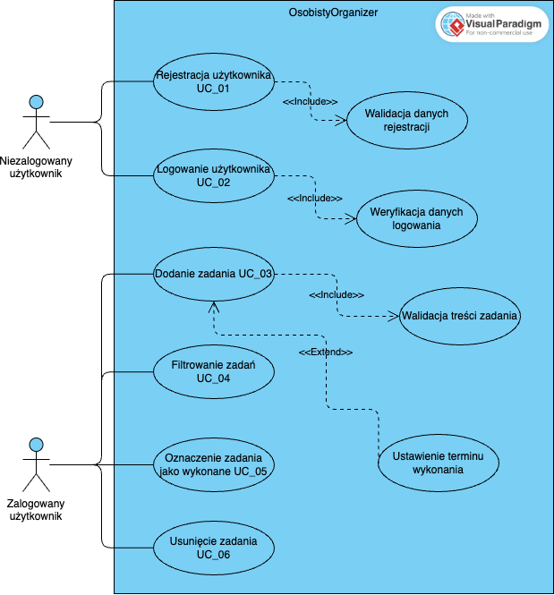

# Diagram przypadków użycia — OsobistyOrganizer

Diagram przedstawia główne przypadki użycia aplikacji **OsobistyOrganizer** oraz ich powiązanie z opisami znajdującymi się w pliku `use-cases.md`.

Diagram został przygotowany w **Visual Paradigm Online**.

